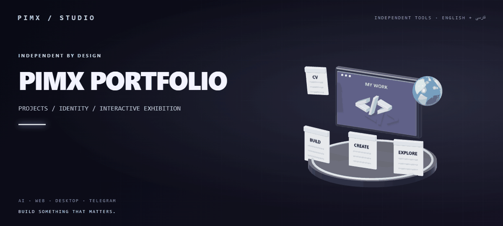
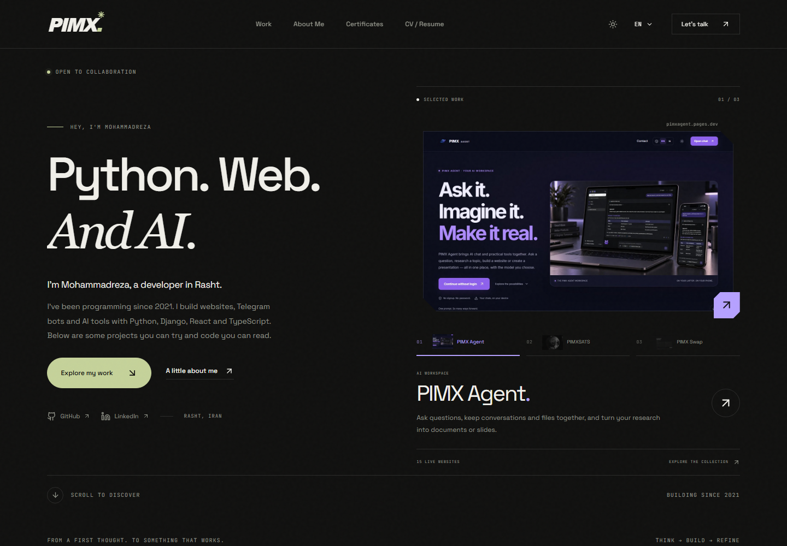
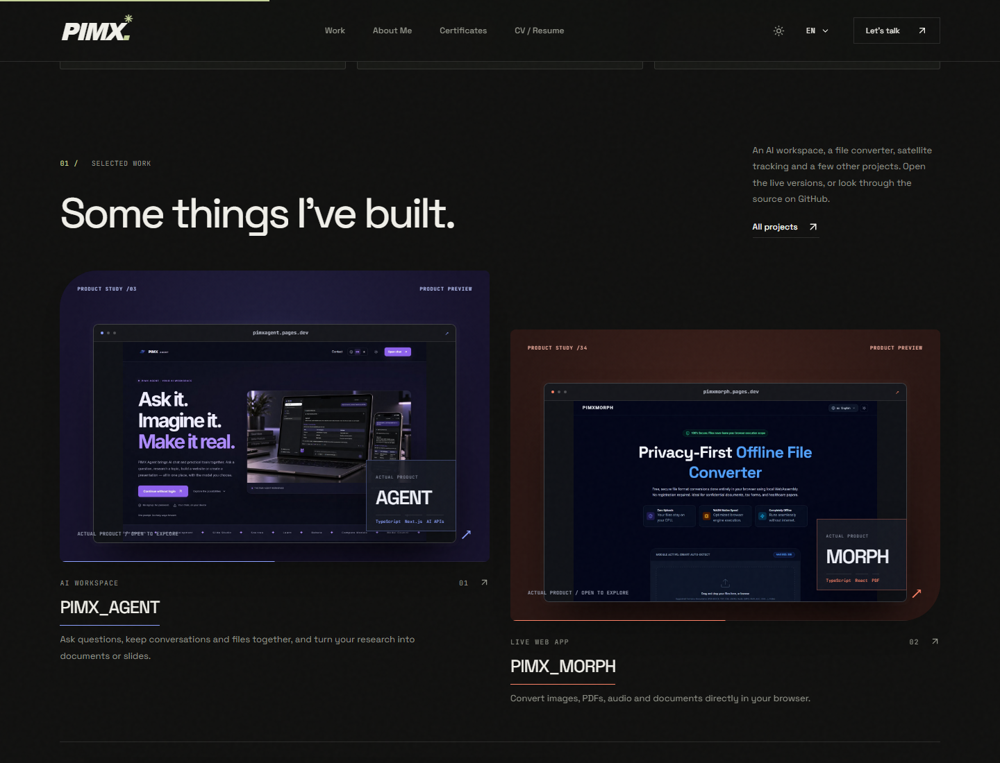
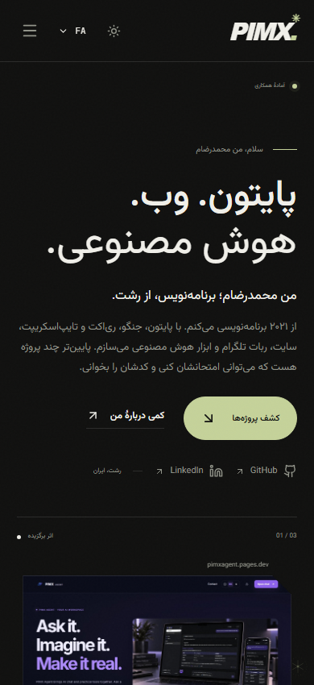

<div align="center">



**[🌐 English](README.md) · [🇮🇷 فارسی](README.fa.md)**

**[Open the portfolio ↗](https://pimx.pages.dev/) · [فارسی](README.fa.md) · [GitHub profile](https://github.com/MOHAMMADREZAABEDINPOOR)**


</div>

# 🌌 PIMX PORTFOLIO · Personal project exhibition

I’m Mohammadreza Abedinpoor, a developer based in Rasht, Iran. I’ve been programming since 2021, working with Python, Django, web interfaces, Telegram bots and AI tools. This repository is the portfolio that brings those projects, source links, certificates and my CV together.

The homepage shows six selected projects. The project directory contains the wider catalogue, with live destinations, technical details and source attribution. Product previews show the actual interfaces, while the site’s copy describes what you can do with each tool.

<!-- pimx-live-site:start -->
**Live website: [pimx.pages.dev](https://pimx.pages.dev/)**
<!-- pimx-live-site:end -->

[Preview](#preview) · [Features](#features) · [Run locally](#run-locally) · [Deploy](#deploy) · [Customize](#customize) · [Checks](#checks)

## 🎨 A project exhibition with its own identity

The portfolio brings real product captures, dedicated Three.js sculptures, source attribution and a multilingual personal story into one place. The original README animation is rendered from a browser, floating project cards, a globe and a CV; its static alternative is available [here](assets/readme/hero.png).

| Journey | Experience |
|:---|:---|
| 🪐 Explore | Select a featured project and inspect its actual product preview |
| 🔎 Discover | Search and filter the larger catalogue before opening a project detail |
| 🌐 Read | Switch among ten interface languages with RTL support |
| 📄 Learn more | Browse the CV, original credentials and personal background |
| 🛠️ Build your own | Edit the local catalogue, translations, visual profiles and page copy |

## Preview



<details>
<summary><strong>Project cards and Persian mobile layout</strong></summary>

<br />


<br />


</details>

## Features

| Area | What’s included |
| --- | --- |
| Personal homepage | Six selected projects, a three-project hero selector, skills and a short introduction |
| Project directory | Search, language/category filters, live previews and detailed project dialogs |
| Motion | Pointer-driven card depth, hover actions, About text effects and measured project-height transitions |
| Page entry | The same visual portal on first entry, refresh and navigation; a cold route stays covered until ready |
| Languages | English, Persian, Arabic, German, French, Italian, Chinese, Russian, Greek and Latin |
| Reading & navigation | RTL layouts, keyboard-operated language menus, dark/light themes and reduced-motion support |
| CV & learning | Independent CV language selection, online/downloadable CV and available original certificate PDFs |
| Performance | Lazy route/locale bundles, one scroll scheduler, and offscreen animation pausing |

### The catalogue

The checked-in snapshot contains **69 project records**, including **58 GitHub repositories**, **15 live website destinations**, and **one active Telegram bot destination**. These are catalogue records, not applications embedded in this repository. Forks, legacy portfolio records and standalone source repositories keep their own attribution and labels.

Examples include [PIMX Agent](https://pimxagent.pages.dev/), [PIMX Morph](https://pimxmorph.pages.dev/), satellite exploration, character art and peer-to-peer file transfer. The directory contains the rest. See the [inventory notes](docs/GITHUB_PROJECTS.md).

### Pages

| Route | Content |
| --- | --- |
| `/` | Introduction and selected work |
| `/project` | Project exhibition and searchable catalogue |
| `/about` | Background, skills and education |
| `/playground` | Certificates and learning records |
| `/resume` | CV, language selection and PDF |
| `/contact` | Contact details and email composition |

## Run locally

Use **Node.js 22.12 or newer** and npm. The lockfile is committed.

```bash
git clone https://github.com/MOHAMMADREZAABEDINPOOR/pimxportfolio.git
cd pimxportfolio
npm ci
npm run dev
```

Open **http://localhost:3000**. A different port can be set with `PORT`.

### Commands

| Command | Purpose |
| --- | --- |
| `npm run dev` | Express server with Vite middleware and development updates |
| `npm run lint` | TypeScript checks (`tsc --noEmit`) |
| `npm run build` | Vite frontend and bundled Node server in `dist/` |
| `npm start` | Run the built server; set `NODE_ENV=production` for production mode |

### Configuration

Copy `.env.example` to `.env` if you need local overrides.

| Setting | Purpose |
| --- | --- |
| `PORT` | Local/Node server port; defaults to `3000` |
| `APP_URL` | Public URL documented in the environment example |
| `PIMX_VISITS` | Optional Cloudflare KV binding for Pages analytics functions |

The portfolio does not require an external AI API key. The Node prompt endpoint uses a local structured template. Contact composition opens the visitor’s email client through `mailto:`; it does not send email from the server.

## Deploy

### Cloudflare Pages

This project includes a [Pages configuration](wrangler.toml) and [Pages Functions](functions/).

1. Connect this repository to a Pages project.
2. Set the build command to `npm run build` and the output directory to `dist`.
3. Use a supported Node version for the build.
4. To use server-stored analytics, attach a KV namespace under the binding name `PIMX_VISITS`. The namespace ID in `wrangler.toml` belongs to this deployment; change it for a different account.

A repository-connected Pages project can deploy new commits automatically when that integration is enabled.

### Node hosting

```bash
npm ci
npm run build
NODE_ENV=production npm start
```

PowerShell:

```powershell
npm ci
npm run build
$env:NODE_ENV = 'production'
npm start
```

The local Express server does not emulate Cloudflare Pages Functions. The local analytics helper includes estimated/demo data; use the configured Pages/KV functions for server-stored visitor records.

## Customize

| Path | What to edit |
| --- | --- |
| [`src/lib/human_copy.ts`](src/lib/human_copy.ts) | Personal introduction and footer copy in ten languages |
| [`src/lib/portfolio_home_copy.ts`](src/lib/portfolio_home_copy.ts) | Remaining homepage labels and service copy |
| [`src/lib/project_notes.ts`](src/lib/project_notes.ts) | Plain-language descriptions of selected tools |
| [`src/lib/project_translations.ts`](src/lib/project_translations.ts) | Combined project catalogue and translated records |
| [`src/lib/site_locales/`](src/lib/site_locales/) | Locally bundled interface translations |
| [`src/lib/site_text_review.ts`](src/lib/site_text_review.ts) | Reviewed wording and product-name overrides |
| [`src/lib/cv_data.ts`](src/lib/cv_data.ts) | CV, contact details and credential data |
| [`src/components/`](src/components/) | Shared interface, previews and motion components |
| [`src/styles/human.css`](src/styles/human.css) | Quieter palette, typography and page framing |
| [`public/`](public/) | Project captures, fonts, PDFs, favicon and search metadata |
| [`functions/api/analytics/`](functions/api/analytics/) | Cloudflare tracking and statistics endpoints |

Keep product names and source attribution intact when editing the catalogue. Linked projects are separate applications with their own deployments.

## Checks

The current redesign was reviewed in Chromium. Saved reports cover:

- **60 page/language combinations at 300px**, without horizontal overflow or runtime errors.
- **40 homepage layouts at 390, 768, 1440 and 2560px**, across all ten languages.
- **54 localized pages**, with no untranslated expected interface phrases.
- Initial loading before JavaScript arrives, refresh, slow route loading, navigation, hero selection, pointer exit, keyboard focus and reduced motion.

These are recorded browser checks, rather than a guarantee for every device. See [validation notes](docs/VALIDATION.md).

To rerun the browser checks, install Python and Playwright, start a production preview, and point the scripts at it:

```bash
python -m pip install playwright
python -m playwright install chromium
PORTFOLIO_TEST_URL=http://localhost:3000 python docs/verify-home-redesign.py
PORTFOLIO_TEST_URL=http://localhost:3000 python docs/check-localization.py
PORTFOLIO_TEST_URL=http://localhost:3000 TEST_LANGUAGES=en,fa,ar,de,fr,it,zh,ru,el,la TEST_WIDTHS=300 python docs/check-responsive.py
```

In PowerShell, set the corresponding environment variables using `$env:NAME = 'value'` before running the script. Browser review output is generated locally and is excluded from Git.

## About the repository

Built with **React 19**, **TypeScript**, **Vite**, **Motion**, **Three.js**, **Tailwind CSS**, **Lucide** and **Express**. The repository currently has no declared license file.

**[Mohammadreza Abedinpoor](https://github.com/MOHAMMADREZAABEDINPOOR) · [Portfolio](https://pimx.pages.dev/) · [فارسی](README.fa.md)**
